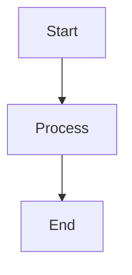

# AutoGen Streaming Chat API

A streaming FastAPI backend for AI assistant built with AutoGen Core, compatible with Vercel AI SDK.

## Features

- 🔄 **Real-time streaming** responses
- 📊 **Advanced data visualization** with charts and tables
- 🗂️ **Structured table output** with column types and sorting
- 🎨 **Mermaid diagram generation**
- 💻 **Code generation** with syntax highlighting
- 🌐 **CORS enabled** for frontend integration

## Setup

### 1. Clone the repository
```bash
git clone <your-repo-url>
cd autogen_bk
```

### 2. Install dependencies
```bash
pip install -r requirements.txt
```

### 3. Configure your API key
```bash
# Copy the template file
cp model_config.yaml.template model_config.yaml

# Edit model_config.yaml and add your OpenAI API key
# Replace YOUR_OPENAI_API_KEY_HERE with your actual API key
```

### 4. Run the server
```bash
# Using uvicorn directly
uvicorn app:app --host 0.0.0.0 --port 8501 --reload

# Or using Python
python app.py
```

## API Endpoints

- **POST** `/api/chat` - Streaming chat completions (Vercel AI SDK compatible)
- **GET** `/health` - Health check endpoint

## Output Formats

The assistant supports multiple output formats:

### 📊 Charts
```json
{
  "chartType": "bar",
  "data": [...],
  "config": {...}
}
```

### 📋 Tables
```json
{
  "title": "Data Dashboard",
  "columns": [...],
  "data": [...],
  "summary": {...}
}
```

### 🗺️ Mermaid Diagrams


## Environment Variables

The application reads configuration from `model_config.yaml`. Never commit this file with real API keys.

## Security Notes

- `model_config.yaml` is gitignored to protect API keys
- Use `model_config.yaml.template` as a reference
- Set up environment variables in production

## Development

To run with auto-reload:
```bash
uvicorn app:app --host 0.0.0.0 --port 8501 --reload
```

## License

MIT License
